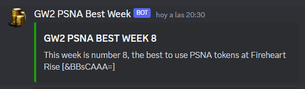

# Notification example

# What does the bot do?
- It sends a notification to IDCHANNEL on week number 8, Wednesday, after 10am (week-day-hour can be customized in the code) to use [psna](https://wiki.guildwars2.com/wiki/Map_bonus_reward#Central_Tyria_reward_track_rotation) tokens at Fireheart Rise [&BBsCAAA=].
- Slash command /week to return current week number (need the `applications.commands` scope authorized in the guild, and `bot permissions` related to messages).

# Install
- npm install
- Create a file called .env with:
    - TOKEN=YOUR_DISCORD_BOT_TOKEN
    - IDCHANNEL='YOUR_CHANNEL_ID'
    - GUILD_ID='YOUR_SERVER_ID'
    - CLIENT_ID='BOT_ID'

# Run bot
- node .\deploy-commands.js (only once for registering slash commands in the guild or updating them)
- npm run start

The bot is tested with [discord.js v14](https://discordjs.guide/preparations/) (requires Node v16.9.0 or higher).